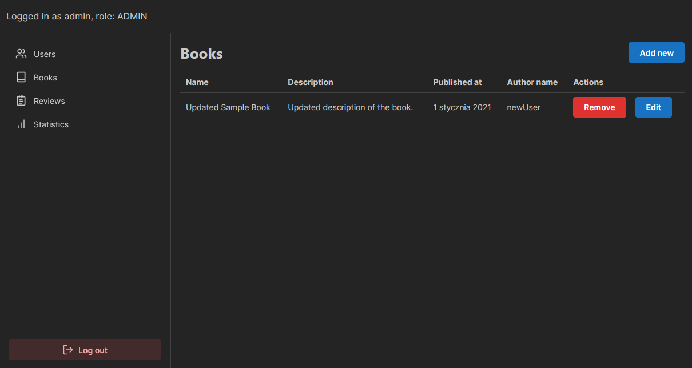
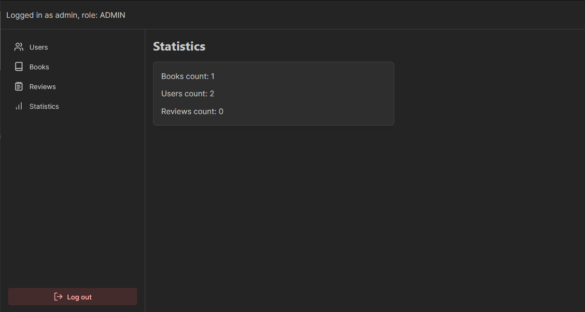
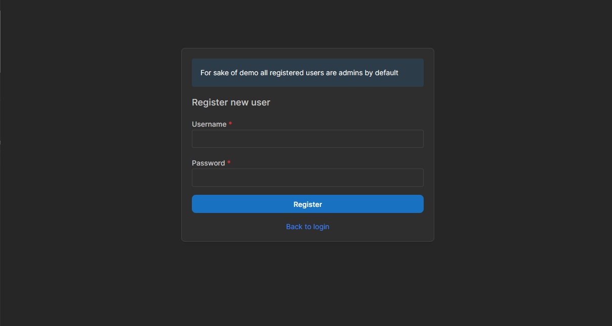

### Programowanie Aplikacji Backendowych - Maciej Wiatr

### How to run

In main folder run

```sh
docker compose up
```

This will spin up two services:

- API at [http://localhost:3001/api](http://localhost:3001/api)
- Frontend at [http://localhost:3000](http://localhost:300)

### Project structure

#### frontend/\*\*

> Frontend app written in [React](https://react.dev/)/[Next.js](https://nextjs.org/)

### api/\*\*

> Backend application written in [Nest.js](https://nestjs.com/)

### Project requirements

- Minimum of 3 entities
  - There are 3 entities representing User, Books and Reviews
- Http header middleware
  - Auth middleware is based on HTTP `Authorization` Header
- JWT Auth was implemented
- Swagger is visible at http://localhost:3001/api
- GraphQL service can be found at http://localhost:3001/graphql
- Frontend page features login page
- There are two roles ADMIN and USER, only admin can access and modify entities
- Frontend implements graphql client on admin/stats page

### Screenshots





### Test curl commands

1. **Register a New User**

   ```bash
   curl -X POST http://localhost:3001/auth/register \
        -H 'Content-Type: application/json' \
        -d '{
              "username": "newUser",
              "password": "userPass"
            }'
   ```

2. **Authenticate (Login) to Get Access Token**

   ```bash
   curl -X POST http://localhost:3001/auth/login \
        -H 'Content-Type: application/json' \
        -d '{
              "username": "newUser",
              "password": "userPass"
            }'
   ```

3. **Create a Book (Using the Authenticated User)**

   ```bash
   curl -X POST http://localhost:3001/books \
        -H 'Content-Type: application/json' \
        -H 'Authorization: Bearer <token>' \
        -d '{
              "name": "Sample Book",
              "description": "A detailed description of the book.",
              "userId": <user_id>,
              "publishedAt": "2021-01-01T00:00:00Z"
            }'
   ```

4. **Fetch All Books**

   ```bash
   curl -X GET http://localhost:3001/books \
        -H 'Authorization: Bearer <token>'
   ```

5. **Update a Book**

   ```bash
   curl -X PATCH http://localhost:3001/books/{bookId} \
        -H 'Content-Type: application/json' \
        -H 'Authorization: Bearer <token>' \
        -d '{
              "name": "Updated Sample Book",
              "description": "Updated description here.",
              "publishedAt": "2022-01-01T00:00:00Z"
            }'
   ```

6. **Delete a Book**

   ```bash
   curl -X DELETE http://localhost:3001/books/{bookId} \
        -H 'Authorization: Bearer <token>'
   ```

7. **Create a Review for a Book**

   ```bash
   curl -X POST http://localhost:3001/reviews \
        -H 'Content-Type: application/json' \
        -H 'Authorization: Bearer <token>' \
        -d '{
              "rating": 5,
              "userId": 1,
              "bookId": 1,
              "createdAt": "2023-01-01T00:00:00Z",
              "updatedAt": "2023-01-01T00:00:00Z"
            }'
   ```

8. **Fetch All Reviews**

   ```bash
   curl -X GET http://localhost:3001/reviews \
        -H 'Authorization: Bearer <token>'
   ```

9. **Delete a Review**

   ```bash
   curl -X DELETE http://localhost:3001/reviews/{reviewId} \
        -H 'Authorization: Bearer <token>'
   ```

10. **Get User Profile (Current Logged-In User)**
    ```bash
    curl -X GET http://localhost:3001/users/current \
         -H 'Authorization: Bearer <token>'
    ```
